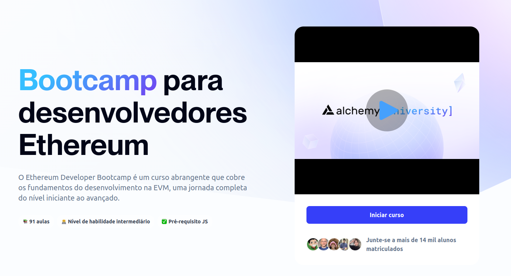

# Atividades do Grupo de Estudos em Solidity

 

Este repositório contém o conteúdo do [Bootcamp da Ethereum na Alchemy University](https://www.alchemy.com/university/courses/ethereum).
A organização segue a estrutura das semanas, tópicos e desafios do bootcamp.

As soluções para os desafios foram baseadas no repositório [Dkdaniz/alchemy-ethereum-bootcamp](https://github.com/Dkdaniz/alchemy-ethereum-bootcamp).

Se você identificar algum problema ou tiver sugestões de melhorias, sinta-se à vontade para abrir um pull request com sua solução.
